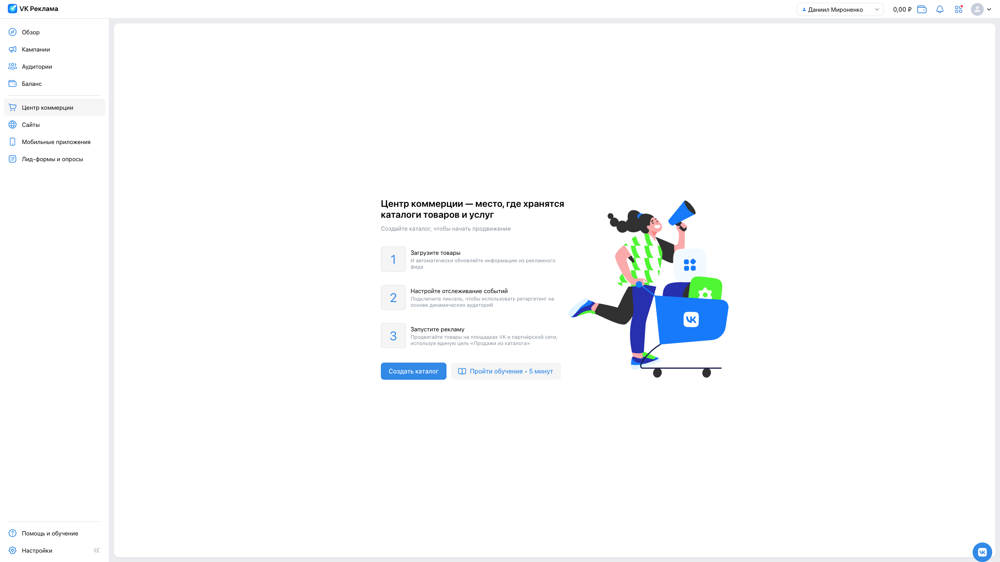
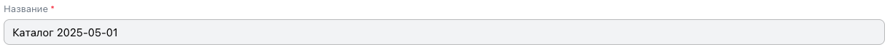
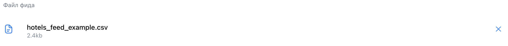
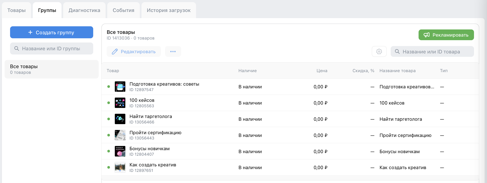

# Чек-листы для [VK Реклама](https://ads.vk.com/)

## Центр коммерции

[Ссылка на страницу](https://ads.vk.com/hq/ecomm/catalogs)

### Просмотр каталогов

#### Если у пользователя 0 созданных каталогов

1. На странице есть
   - заголовок со значением "Центр коммерции — место, где хранятся каталоги товаров и услуг"
   - описание раздела "Создайте каталог, чтобы начать продвижение"
   - инструкция с шагами "Загрузите товары", "Настройте отслеживание событий", "Запустите рекламу"
   - кнопка "Создать каталог"
   - кнопка "Пройти обучение"
2. При нажатии на кнопку "Создать каталог" открывается модальное окно "Новый каталог"
3. При нажатии на кнопку "Пройти обучение" открывается модальное окно с выбором способа обучения

### Модальное окно "Новый каталог"

1. При открытии модального окна поле "Название" имеет значение "Каталог <дата>". Дата в формате `yyyy-mm-dd`

2. Ошибка "Нужно заполнить" при удалении значения из поля "Название"
3. При нажатии на кнопку селекта "Добавление позиций" бордер кнопки становится акцентного цвета `#2588eb`
4. При нажатии на кнопку селекта "Добавление позиций" набор полей в форме меняется
5. При нажатии на кнопку "Создать каталог" открывается страница "История загрузок" созданного каталога (после заполнения обязательных полей)

6. Закрытие модального окна "Новый каталог" при нажатии на крести в верхнем левом углу модального окна
7. Закрытие модального окна "Новый каталог" при нажатии на кнопку "Отмена"

> [!WARNING]  
> Если не нажата ни одна из кнопок селекта "Добавление позиций", то при нажатии на кнопку "Создать каталог" не показывается уведомление о том, что такое действие недопустимо, пока форма не заполнена

#### Фид или сообщество

1. Ошибка "Нужно заполнить" при удалении значения из поля "Ссылка на фид или сообщество" после нажатия на кнопку "Создать каталог"
2. Ошибка "Необходимо указать протокол http(s)" при вводе ссылки без протокола или ссылки с протоколом отличным от http и https `education.vk.company/` в поле "Ссылка на фид или сообщество"
3. Ошибка "Невалидный url" при вводе невалидного url `https://` в поле "Ссылка на фид или сообщество"
4. Появляется кнопка "Ввести логин или пароль" при вводе валидного url `https://education.vk.company/` в поле "Ссылка на фид или сообщество"

5. При наведении на иконку вопросительного знака появляется подсказка "Укажите данные для авторизации, если фид защищён паролем"
6. Кнопка "Ввести логин или пароль заменяется" на поля "Логин" и "Пароль" при нажатии на нее

7. Ошибка "Неверный формат файла" при вводе ссылки, содержащей не фид и не сообщество (например, `https://education.vk.company/`) после нажатия на кнопку "Создать каталог"
8. Ошибка "Неверный формат файла" при вводе ссылки на фид или сообщество, не содержащей ни одного товара или услуги (например, `https://vk.com/vkeducation`) после нажатия на кнопку "Создать каталог"
9. Появляется подсказка "В этом сообществе недостаточно товаров или услуг" при вводе ссылки на фид или сообщество, не содержащей ни одного товара или услуги
10. При актиной галочки "Автоматически удалять UTM-метки" удаляются UTM-метки, которые конфликтуют с метками VK Рекламы

> [!WARNING]  
> При вводе цифры после значения `http://` или `https://` в поле "Ссылка на фид или сообщество" не должна подставляться подстрока `0.0.0.0`. Нажатие на клавишу `Delete` не удаляет эту подстроку (удалить подстроку можно только полностью выделив ее)

#### Маркетплейс

1. Ошибка "Нужно заполнить" при удалении значения из поля "Ссылка на страницу продавца"
2. Ошибка "Необходимо указать протокол http(s)" при вводе ссылки без протокола или ссылки с протоколом отличным от http и https `education.vk.company/` в поле "Ссылка на страницу продавца"
3. Ошибка "Невалидный url" при вводе невалидного url `https://` в поле "Ссылка на страницу продавца"

4. Ошибка "Введите корректную ссылку на страницу продавца на поддерживаемом маркетплейсе" при вводе валидной ссылки не на страницу продавца на маркетплейсе Wildberries, OZON, Aliexpress, Яндекс.Маркет `https://education.vk.company/`
5. Переход на страницу предоставления доступа по протоколу OAuth после нажатия на кнопку "Предоставить доступ"

#### Вручную

1. При нажатии на кнопку "Скачать шаблон фида <категория>" скачивается шаблон соответствующей категории в формате csv
2. При загрузке файла одного из форматов csv, tsv, xml, yml размером до 100 МБ поле прикрепления файла заменяется на имя файла с его размером

3. При загрузке файла невалидного формата (csv, tsv, xml, yml) под полем прикрепления файла показывается ошибка со списком валидных форматов (csv, tsv, xml, yml)
   > [!WARNING]  
   > Под полем прикрепления файла не показывается сообщение об ошибке со списком валидных форматов - csv, tsv, xml, yml
4. При загрузке файла размером 100 МБ и более под полем прикрепления файла показывается ошибка с указанием максимального допустимого размера файла
   > [!WARNING]  
   > Под полем прикрепления файла не показывается сообщение об ошибке с указанием максимального допустимного размера файла - 100 МБ
5. При нажатии на крестик у загруженного файла фида отображается поле прикрепления файла
6. При актиной галочки "Автоматически удалять UTM-метки" удаляются UTM-метки, которые конфликтуют с метками VK Рекламы
7. Ошибка "Нужно заполнить" под полем прикрепления файла фида при нажатии на кнопку "Создать каталог"

#### Если у пользователя >0 созданных каталогов

1. На странице есть
   - кнопка "Создать каталог"
   - поле вводе "Поиск"
   - таблица с каталогами товаров, содержащая столбцы "Каталог", "Статус", "Товары", "Кампании", "Последнее обновление", "Владелец"
2. При нажатии на кнопоку "Создать каталог" открывается модальное окно "Новый каталог"
3. При вводе значения в поле "Поиск" в таблице остаются только каталоги, удовлетворяющие запросу
4. Появляется сообщение "Ничего не нашлось" вместо таблицы с каталогами, если по запросу в поле "Поиск" ничего не найдено
5. Переход на страницу выбранного каталога при нажатии на название каталога в таблице

### Настройка каталога

1. При нажатии на кнопку "Отмена" модальное окно настроек закрывается
2. При нажатии на крестик модальное окно настроек закрывается
3. При нажатии на кнопку "Сохранить" измененные поля формы сохраняются
4. При нажатии на кнопку "Удалить каталог" открывается модальное окно подтверждения удаления
   
   - при нажатии на крестик модальное окно закрывается
   - при нажатии на кнопку "Отменить" модальное окно закрывается
   - при нажатии на кнопку "Удалить" модальное окно закрывается, каталог удаляется

### Товары

1. При нажатии на иконку шестеринки открывается модальное окно "Настройка таблицы"
2. При нажатии на кнопку "Рекламировать" открывается страница "Настройка кампании"

#### Настройка таблицы

1. При нажатии на кнопку "Сбросить" все чекбоксы группы становятся неактивными, текст кнопки заменяется на "Выбрать все", цвет текста становится синим
2. При нажатии на кнопку "Выбрать все" все чекбоксы группы становятся активными, текст кнопки заменяется на "Сбросить", цвет текста становится красным
3. При нажатии на кнопку "Закрыть" модальное окно "Настройка таблицы" закрывается
4. При нажатии на кнопку "Применить" выбранные чекбоксы сохраняются, модальное окно "Настройка таблицы" закрывается
5. При нажатии на кнопку "Сбросить" в разделе "Порядок столбцов" все чекбоксы групп становятся активными
6. При нажатии на крестик настройки в разделе "Порядок столбцов" чекбокс соответствующей настройки становится неактивным
7. При перетаскивании настройки в разделе "Порядок столбцов" порядок настроек сохраняется

### Группы

1. При нажатии на кнопку "Создать группу" появляется выпадающий список с двумя вариантами: "Использовать фильтры" и "Выбрать товары вручную" 
   
   - при нажатии на кнопку "Использовать фильтры" открывается окно создания группы с использованием фильтров
   - при нажатии на кнопку "Выбрать товары вручную" открывается окно создания группы вручную
2. При нажатии на кнопку "Рекламировать" открывается страница "Настройка кампании"
3. При нажатии на кнопку "Редактировать" появляется окно редактирования группы

#### Новая группа товаров

##### Использовать фильтры

1. При нажатии на кнопку "Добавить фильтр" в список фильтров добавляется новый
2. При изменении фильтров меняется список товаров в соответствии с фильтрами
3. При нажатии на товар отображается окно с информацией о товаре
4. При нажатии на кнопку "всем условиям"/"хотя бы одному из условий" открывается выпадающее окно с выбором режима фильтрации
   - при нажатии на "всем условиям" режим фильтрации - "пересечение"
   - при нажатии на "хотя бы одному из условий" режим фильтрации - "объединение"
5. Ошибка "Группа с такими фильтрами уже существует" при попытке создания группы с уже существущими фильтрами
   
6. При нажатии на кнопку "Сохранить" создается новая группа с заданными параметрами, группа появляется в списке групп

##### Выбрать товары вручную

1. При нажатии на товар отображается окно с информацией о товаре
2. Чекбокс товара становится активным при нажатии на него
3. При нажатии на кнопку "Добавить списком" открывается модальное окно "Добавление списка"
   
   - при нажатии на кнопку "Добавить в группу" чекбоксы соответствующих товаров в списке становятся активными
   - при нажатии на крестик модальное окно закрывается
4. При нажатии на "Выбор товаров" отображается список всех товаров с чекбоксами для их выбора
5. При нажатии на "Выбранные" отображается список выбранных товаров
6. При нажатии на кнопку "Отмена" модальное окно создания группы закрывается
7. При нажатии на крестик модальное окно создания группы закрывается
8. При нажатии на кнопку "Сохранить" создается новая группа, модальное окно закрывается, в списке групп появляется созданная группа

### Диагностика

- Если в каталоге нет ошибок, то отображается сообщение "Все хорошо!"
   
- Если в каталог есть ошибки
   1. отображается
      - кнопка "Скачать полный отчёт"
      - кнопка "Проверить снова"
      - селект "Тип проблем" для фильтрации отображаемых проблем каталога
   2. при нажатии на "проблему" показывается подробная информация о проблеме
   
   3. при нажатии на кнопку "Скачать полный отчёт" скачивается отчет о проблемах
   4. при нажатии на селект "Тип" появляется список с фильтрами "проблем"

### История загрузок

1. При нажатии на кнопку "Обновить сейчас" принудительно обновляется информация о каталоге
2. В таблице содержится список обновлений
3. При нажатии на кнопку "Посмотреть ошибки" открывается раздел "Диагностика"
4. При нажатии на кнопку "Проверить снова" каталоги проверяются на наличие ошибок
